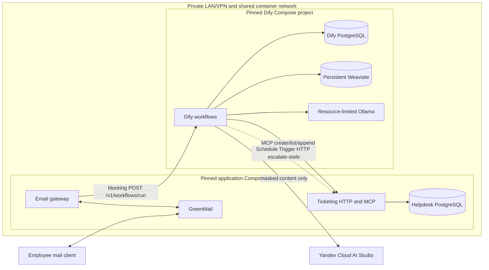
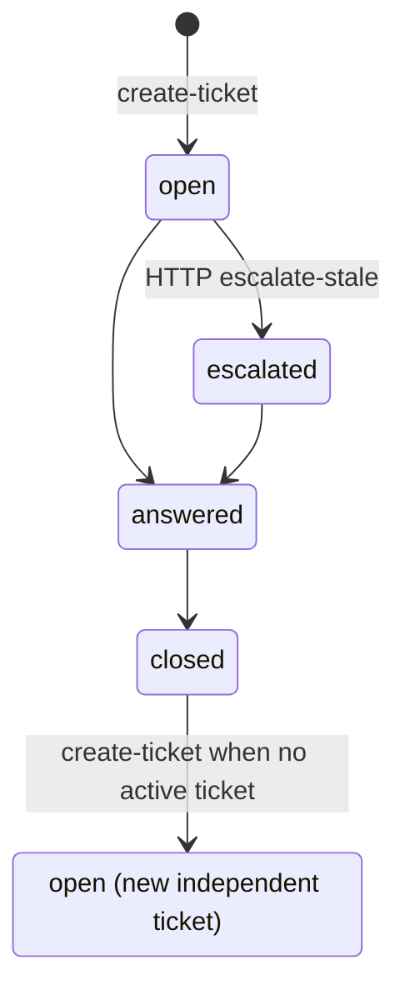

# v1 Architecture

This is the design target. Transport and durable business behavior stay
outside Dify. The gateway depends on a small blocking HTTP contract, not
Studio internals. Dify still orchestrates the LLM/KB/MCP graph.

The design is an LLM-focused slice: email in; Dify routes per the ticket/KB
table; `open` tickets whose `updated_at` is older than the inactivity
threshold (default 24h / `escalation_seconds`) become `escalated`. This
slice stops at escalate — after that is out of scope and not modeled.
`answered` and `closed` remain in the schema unused here.

## Modules and interfaces

- **Email gateway module** — generic IMAP poll (default 1 minute,
  configurable; GreenMail is the adapter, not its HTTP mail API), content
  normalization (plain text / sanitized HTML; ignore attachments), one-way
  PII masking via `src/privacy` **before** any Dify call, blocking Service
  API `POST …/v1/workflows/run`, validation of `data.outputs`, SMTP reply
  using the live mail-session recipient, then optional IMAP `\Seen`. No
  application outbox. After masking, ordered gateway regex intake
  (toxicity then hello) may SMTP-reply without Dify. No gateway MCP,
  escalate-in-gateway, or size/rate gates (limits deferred).
- **Dify brain module** — two Workflow-type Apps:
  - `email_helpdesk` — User Input start; `list-my-tickets` branch, KB/MCP
    paths, injection/scope (later phases), grounded Yandex generation. MCP
    tools (`create-ticket`, `list-my-tickets`, `append-message`) are called
    **only from Dify**. Toxicity/hello are gateway regex, not this graph.
  - Escalate — Schedule Trigger (daily / 24h) that **only** HTTP-calls
    `POST /v1/tickets/escalate-stale`. No escalate rules in Dify.
- **Ticketing module** — the sole authority for tickets, messages, escalation
  validity, and employee scope. It derives employee scope from the `user_id`
  tool argument (synthetic sender email) on `tickets.user_id`. MCP tools are
  `create-ticket`, `list-my-tickets`, and `append-message`. Private HTTP is
  `POST /v1/tickets/escalate-stale`. v1 schema is intentionally small:
  `tickets` and `messages` (`messages.ticket_id` required FK; employee
  scope lives on `tickets.user_id` only).
- **Privacy module** — deterministically one-way masks email, phone-like values,
  and Luhn-valid payment-card candidates into placeholders. The gateway uses it
  before Dify and the ticketing module applies it again at its persistence seam
  for ticket/message text. Masking is not reversible encrypt/decrypt.
- **Knowledge module** — treats versioned Markdown in Git as canonical,
  produces trusted source metadata, and reproducibly ingests one Dify
  knowledge base. Retrieval (provisional, later phases): local bi-encoder
  `granite-embedding:30m` via Ollama, then LLM-as-reranker (small Yandex
  Cloud AI Studio FM, model TBD). Defaults: `candidate_k=10` → rerank →
  `rerank_top_k=3` if score ≥ `0.7`. Citations are trusted Git URLs under a
  configured repo base to future `knowledge_base/` paths.
- **Lifecycle schedule** — the Escalate Dify app calls private HTTP
  `POST /v1/tickets/escalate-stale`. Ticketing selects `open` rows whose
  `updated_at` is older than the inactivity threshold (default
  `Settings.escalation_seconds` / 86400) and sets `escalated` (status-only).
  Append refreshes `updated_at`, so ongoing dialogue delays escalate.
  That is the last lifecycle step this slice implements.

## Conceptual application contracts

The **private HTTP adapter** is not a ticket resource API. It exposes
`POST /v1/tickets/escalate-stale`.
Escalate is status-only. A classifier or workflow outage yields a static
acknowledgement with no fail-open; the gateway SMTP-sends it. Ticketing
does not require a quarantine or outbox table.

The **MCP adapter** takes `user_id` (synthetic sender email) as a tool
argument on each call. Only Dify invokes these tools:

- `create-ticket` creates one scoped `open` ticket: masked `text` in
  `tickets.text` (set at create, not updated). **No message row.** Rejects if
  this `user_id` already has a non-`closed` ticket.
- `list-my-tickets` lists only tickets for that `user_id`.
- `append-message` inserts one `user` or `agent` row on an existing ticket
  and bumps `tickets.updated_at` (activity) so escalate waits. Required:
  `ticket_id`, `user_id`, `text`, `role`. Load the ticket and deny
  with `NOT_FOUND` when missing or `ticket.user_id != user_id`. Agent rows
  may set tutor usage. Append does not change ticket text or status. Return
  is `message_id` and `ticket_id` (always set).

The **workflow** (not the create tool) adds the first user mail via
`append-message` after `create-ticket`. No MCP tool answers or escalates
tickets. For the course MVP, ticketing stores synthetic sender email as
`tickets.user_id`. A call is scoped to its `user_id` argument (wrong ticket
id is rejected); choosing another employee's email is not prevented. This
is not production authentication.

## Deployment topology



The two Compose projects use pinned images, plugins, and model tags. Yandex
Cloud AI Studio is the only external model provider receiving application
content in v1; configuration and acceptance reject OpenAI, watsonx, Cohere,
Jina, and other external providers. Ollama is internal (embeddings). Dify's
PostgreSQL and helpdesk PostgreSQL never share ownership or schemas.

Compose definitions live at root `compose.yml` (application stack:
email-gateway, ticketing, helpdesk PostgreSQL, GreenMail) and
`dify/compose.yml` (Dify platform: Dify, its PostgreSQL, Weaviate, Ollama).
Each file carries a short top comment naming the stack. The Dify project
creates the shared Docker network `helpdesk_private`; the application
project joins it as external (start Dify first). The root `Makefile` wraps
both with foreground `make dify-stack-up` / `make app-stack-up` (two
terminals). Secret-free Dify App DSL exports live under `dify/apps/` —
`email_helpdesk.yml` is a committed Start→End echo (End emits `reply_text`).
Phase 5 authors the full email graph and re-exports. The Escalate app is
Phase 8.

## Minimal Dify contract

Gateway-facing app: `email_helpdesk`. Start field types: `user_email` and
`subject` = short text; `request_text` = paragraph. **Not** JSON Field.

```text
inputs (User Input / Start):
  user_email      # sender mailbox; MCP user_id
  subject
  request_text    # already-masked body

outputs (End):
  reply_text      # required; gateway SMTP-sends this
  ticket_id       # optional; present when a ticket exists/was created
  citations       # optional; omit/skip on KB miss. Trusted repo URLs to
                  # future knowledge_base/ paths. If End cannot emit a list,
                  # a JSON string is allowed.
```

The gateway validates outputs. It rejects citation URLs outside a configured
repository base. Blocking JSON may still expose `workflow_run_id` / usage
metadata. SSE is optional, not the Phase 4 interface.

**Host URL:** `POST http://localhost:13080/v1/workflows/run`  
**In-network (Compose, when the gateway runs in the app stack):**
`http://nginx:80/v1/workflows/run`  
**Header:** `Authorization: Bearer <app key>` from gitignored `.env`
(`DIFY_EMAIL_HELPDESK_API_KEY`). The key is created in the Workflow app:
left sidebar **API Access** (or Publish → Access API) → Create API Key. The
key selects the app; no app UUID in the path.

**Wrong URL:** `/console/api/installed-apps/{id}/workflows/run` (Studio
session). Never use the console API for the gateway.

Blocking example (keys must match Start names):

```json
{
  "inputs": {
    "user_email": "employee@example.test",
    "subject": "VPN",
    "request_text": "already-masked body"
  },
  "response_mode": "blocking",
  "user": "employee@example.test"
}
```

`user` is Dify’s log identity; set it to the same sender. Merge-gate tests
use a **fake** of this contract. Local/opt-in may call live Dify (echo is
enough for Phase 4).

The old `WorkflowRequestV1` / `WorkflowResultV1` action-enum contract is
retired. The gateway waits for `data.outputs`, validates, SMTP-replies,
then may set `\Seen`.

## Controlled request flow

1. The gateway polls IMAP, normalizes mail identity, and uses the sender
   mailbox as `user_email` / MCP `user_id` (MVP).
2. It normalizes plain text or sanitized HTML and ignores attachments.
3. It one-way-masks required PII. Size/rate limits are deferred.
4. Gateway regex intake (toxicity, then hello): a match SMTP-sends a static
   body (no Dify, no KB, no MCP). Otherwise the gateway POSTs blocking
   `/v1/workflows/run`. It does not call MCP.
5. Dify calls `list-my-tickets` and branches. Injection/scope
   nodes (later phases): static block / bounded refusal / outage → static
   acknowledgement (no fail-open). Then ticket/KB routing:

   | State | KB can answer | DB |
   | --- | --- | --- |
   | No non-`closed` ticket | yes | **no** ticket, **no** `messages` — email only + citations |
   | No non-`closed` ticket | no | `create-ticket` **and** `append-message` for the first user mail, then agent append for the reply |
   | Ticket already `open` | yes or no | **always** `append-message` user + agent; **still run KB** |

   Uncategorized legitimate work uses `other`. Employee cannot override a KB
   hit into a new ticket.
6. The gateway validates `data.outputs` (`reply_text` required). Usage on
   the blocking response may be passed on the agent append (Dify performs
   that append). Bad or out-of-scope ids fail on the MCP call inside Dify.
7. The gateway SMTP-sends `reply_text` using the live mail-session
   recipient, then may set IMAP `\Seen`. Effects are best-effort
   at-least-once. SMTP duplicate window: one poll interval (default 60s)
   plus the blocking Dify wait, if send succeeded but `\Seen` was not set.

## Trust seams

- Email bodies, headers, sanitized HTML, retrieved passages, and all model
  output are untrusted. Attachment contents do not enter the system.
- Repository-controlled workflow schemas, tool definitions, governing
  instructions, and source-ID-to-URL mappings are trusted configuration.
  Retrieved document text remains data: embedded instructions cannot change
  routing, tool authorization, or trusted citation URLs.
- Dify and its model are behind a validation seam: only validated
  `data.outputs` (and citation URLs under the configured repo base) can
  drive gateway SMTP. Ticketing independently enforces authorization, valid
  transitions, and masking for every HTTP/MCP mutation.
- MCP tools take `user_id` (sender email) as a tool argument. Ticketing
  scopes each call to that value and rejects ticket ids owned by a different
  `user_id`. Course MVP: the model may supply `user_id`; this is not
  production authentication.
- Yandex Cloud AI Studio is the only external model provider and receives
  only already-masked content. SMTP uses the gateway's live recipient from
  the mail session.
- The HTTP and MCP adapters are private-network interfaces.

## Data ownership

- **Helpdesk PostgreSQL** (`helpdesk-db`): v1 tables are `tickets` (including
  MVP synthetic `user_id` email, category, status, masked `text` set at
  create, timestamps),
  and `messages` (required `ticket_id` FK; role; masked `text`; tutor token
  fields on agent rows). Employee scope is `tickets.user_id` only. No outbox,
  quarantine, idempotency, or scope-binding tables in v1. Ticketing
  persistence uses async SQLAlchemy with the psycopg driver
  (`postgresql+psycopg://`).
- **Dify PostgreSQL:** Dify-owned configuration and workflow operational data,
  isolated from helpdesk business data.
- **Git:** canonical knowledge Markdown, secret-free Dify DSL exports,
  contracts, migrations, and recovery instructions.
- **Weaviate:** derived retrieval index. It is persistent for normal operation
  but disposable and reproducible from Git knowledge.
- **GreenMail/mailbox:** raw synthetic transport messages required for email
  tests. Not the source of truth for ticket/message effects.

No application JSON log is a data store. Application logs contain opaque
references and bounded metadata, never raw content. Ticketing and the email
gateway each have a process-local `logging_config` today (ticketing: text
lines; gateway: JSON). Later, one shared `dictConfig` module under `src/`
(alongside `privacy` / `contracts`): same JSON formatter and SEC-5 extras
allowlist; each process still calls `getLogger(__name__)` under its package
name. Not Phase 4 scope.

## MVP schema (Postgres)

Tutor YDB shapes adjusted for Postgres. Enums and meanings:
[CONTEXT.md](../CONTEXT.md) / FR-6 / `contracts.enums`. `category`, `status`,
and `role` are StrEnums on the ORM (`SQLAlchemy Enum`, `native_enum=False`):
VARCHAR storage, not Postgres ENUM types. Text columns store one-way-masked
content. `tickets.text` is masked ticket text (immutable after create);
a message always belongs to a ticket. Escalation does not insert messages.

```text
tickets
  id          UUID PRIMARY KEY
  user_id     TEXT NOT NULL          -- synthetic sender email (MVP)
  category    VARCHAR NOT NULL      -- TicketCategory
  status      VARCHAR NOT NULL      -- TicketStatus
  text        TEXT NOT NULL          -- masked ticket text (immutable after create)
  created_at  TIMESTAMPTZ NOT NULL
  updated_at  TIMESTAMPTZ NOT NULL
  INDEX (user_id)
  INDEX (status)

messages
  id          UUID PRIMARY KEY
  ticket_id   UUID NOT NULL REFERENCES tickets(id)
  role        VARCHAR NOT NULL      -- MessageRole
  text        TEXT NOT NULL          -- masked
  model       TEXT NULL
  tokens_in   BIGINT NULL
  tokens_out  BIGINT NULL
  latency_ms  INTEGER NULL
  created_at  TIMESTAMPTZ NOT NULL
  INDEX (ticket_id)
```

## Delivery semantics

Ticket/message effects are best-effort and at-least-once. The gateway may
mark an inbound message processed (IMAP `\Seen`) after successful SMTP;
poll retries may repeat mutations.

SMTP remains gateway-owned and at-least-once. Without an outbox table, a crash
after send and before `\Seen` can duplicate the email on the next poll.
Documented window: one poll interval (default 60s) plus the blocking Dify
wait. Receiver-visible exactly-once delivery is not claimed.

## Ticket status machine



The final arrow creates another ticket; it does not reopen or link the closed
one. Phase 3 does not write `answered` or `closed` except tests poking the DB.
`append-message` inserts a message and bumps `tickets.updated_at`; it does
not change ticket text or status. After `escalated` is out of scope / not
modeled.

## Persistence and recovery principles

- Named volumes preserve both PostgreSQL stores and Weaviate across ordinary
  restarts. Migrations are repeatable and backups/restores are tested before
  acceptance.
- Ticket and message data live in PostgreSQL; mailbox flags such as `\Seen` are
  a best-effort processing hint, not a durable exactly-once guarantee in v1.
- Canonical knowledge remains in Git. Reproducible ingestion can delete and
  rebuild the Weaviate index, preserving source IDs and trusted URLs.
- The reviewed, secret-free Dify exports reconstruct workflow structure.
  Provider credentials stay in Dify's encrypted store; other secrets use
  gitignored local files with committed examples only.
- Minimal Make targets cover env/deps bootstrap and foreground stack up/down. Use
  Compose directly for logs/ps. Destructive volume deletion (`<cli> compose … down -v`) is manual
  and irreversible — document the risk before using it.

## Proposed repository tree

```text
.
├── README.md
├── CONTEXT.md
├── docs/
│   ├── requirements.md
│   ├── architecture.md
│   ├── roadmap.md
│   ├── setup.md
│   └── adr/
├── knowledge_base/
├── dify/
│   ├── compose.yml              # Dify platform stack
│   └── apps/                    # one secret-free DSL export per Dify App
│       └── email_helpdesk.yml   # Start→End echo; Phase 5 re-export
├── src/
│   ├── contracts/
│   ├── privacy/
│   ├── email_gateway/
│   └── ticketing/
├── tests/
│   ├── unit/
│   ├── contract/
│   ├── integration/
│   └── e2e/
├── scripts/
├── compose.yml                  # application stack
├── Makefile
└── pyproject.toml
```
