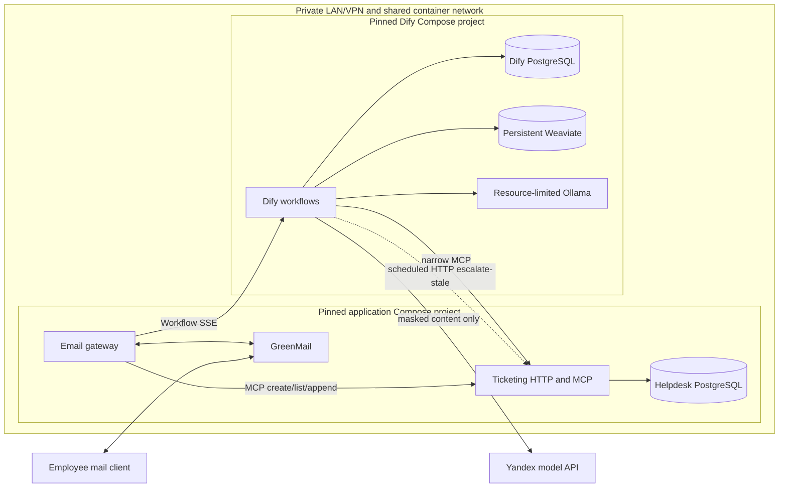
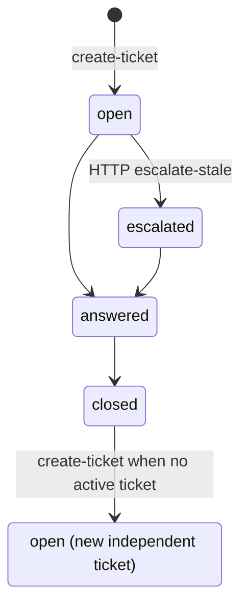

# v1 Architecture

This is the Phase 1 design target, not a description of an implemented runtime.
It keeps transport and durable business behavior outside Dify so the AI brain
can be replaced through one small interface.

The design is an LLM-focused slice: email in; knowledge hit is emailed with a
citation (no ticket, no `messages` row); knowledge gap opens a ticket and
records AI↔employee history; `open` tickets whose `updated_at` is older
than the inactivity threshold (default 24h / `escalation_seconds`) become
`escalated`. This slice stops at escalate — after that is out of scope
and not modeled. `answered` and `closed` remain in the schema unused here.

## Modules and interfaces

- **Email gateway module** — hides generic IMAP/SMTP transport, content
  normalization, size/rate controls, a pre-Dify toxicity/abuse word-list gate
  (static reply, no LLM), pre-Dify one-way PII masking, workflow SSE
  consumption, and direct SMTP reply delivery (no application outbox table).
  GreenMail is its first mail adapter; the normal poll interval is one minute
  and is configurable for tests.
- **Dify brain module** — self-hosted Workflow-type Dify Apps (node graphs) for
  bounded scope/injection classification, ticket-context routing, retrieval,
  grounded Yandex generation, and MCP tools (`create-ticket`,
  `list-my-tickets`, `append-message`). A grounded cited reply is emailed
  only. A knowledge gap or explicit ticket request uses `create-ticket`
  (`text` → `tickets.text`, set once); further dialogue uses
  `append-message` with that `ticket_id`.
  Its only gateway-facing interface is the versioned workflow contract below.
- **Ticketing module** — the sole authority for tickets, messages, escalation
  validity, and employee scope. It derives employee scope from the `user_id`
  tool argument (synthetic sender email) on `tickets.user_id`. MCP tools are
  `create-ticket`, `list-my-tickets`, and `append-message`. Private HTTP is
  `POST /v1/tickets/escalate-stale`. v1 schema is intentionally small:
  `tickets` and `messages` (`messages.ticket_id` required FK; employee
  scope lives on `tickets.user_id` only).
- **Privacy module** — deterministically one-way masks email, phone-like values,
  and Luhn-valid payment-card candidates into placeholders. The gateway uses it
  before Dify and the ticketing module applies it again at its persistence seam
  for ticket/message text. Masking is not reversible encrypt/decrypt.
- **Knowledge module** — treats versioned Markdown in Git as canonical,
  produces trusted source metadata, and reproducibly ingests one Dify
  knowledge base. Dify performs High-Quality hybrid retrieval over Weaviate
  using local `granite-embedding:30m`; no reranker is present initially.
- **Lifecycle schedule** — a scheduler (Dify or otherwise) calls private HTTP
  `POST /v1/tickets/escalate-stale`. Ticketing selects `open` rows whose
  `updated_at` is older than the inactivity threshold (default
  `Settings.escalation_seconds` / 86400) and sets `escalated` (status-only).
  Append refreshes `updated_at`, so ongoing dialogue delays escalate.
  That is the last lifecycle step this slice implements.

## Conceptual application contracts

The **private HTTP adapter** is not a ticket resource API. It exposes
`POST /v1/tickets/escalate-stale`.
Escalate is status-only. A classifier or workflow outage yields a static
acknowledgement with no fail-open; ticketing does not require a quarantine
or outbox table.

The **MCP adapter** takes `user_id` (synthetic sender email) as a tool
argument on each call:

- `create-ticket` creates one scoped `open` ticket: masked `text` in
  `tickets.text` (set at create, not updated). No message row. Rejects if
  this `user_id` already has a non-`closed` ticket.
- `list-my-tickets` lists only tickets for that `user_id`.
- `append-message` inserts one `user` or `agent` row on an existing ticket
  and bumps `tickets.updated_at` (activity) so escalate waits. Required:
  `ticket_id`, `user_id`, `text`, `role`. Load the ticket and deny
  with `NOT_FOUND` when missing or `ticket.user_id != user_id`. Agent rows
  may set tutor usage. Append does not change ticket text or status. Return
  is `message_id` and `ticket_id` (always set).

No MCP tool answers or escalates tickets. For the course MVP, ticketing
stores synthetic sender email as `tickets.user_id`. A call is scoped to its
`user_id` argument (wrong ticket id is rejected); choosing another
employee's email is not prevented. This is not production authentication.

## Deployment topology



The two Compose projects use pinned images, plugins, and model tags. Yandex is
the only external model processor receiving application content in v1;
configuration and acceptance reject other external model providers. Ollama is
internal. Dify's PostgreSQL and helpdesk PostgreSQL never share ownership or
schemas.

Compose definitions live at root `compose.yml` (application stack: gateway,
ticketing, helpdesk PostgreSQL, GreenMail) and `dify/compose.yml` (Dify platform:
Dify, its PostgreSQL, Weaviate, Ollama). Each file carries a short top comment
naming the stack. The Dify project creates the shared Docker network
`helpdesk_private`; the application project joins it as external (start Dify
first). The root `Makefile` wraps both with foreground
`make dify-stack-up` / `make app-stack-up` (two terminals).
Secret-free Dify App DSL exports live under `dify/apps/` after UI authoring
(FR-9) — one YAML export per Studio App (email helpdesk in Phase 5). Phase 2
proves Start→End in the Studio UI without a committed handwritten DSL file.

## Minimal Dify contract

All strings are bounded and the gateway validates both input and output. The
contract contains no raw recipient address and no Yandex-specific shape.

```text
WorkflowRequestV1
  contract_version: "1"
  message_ref: opaque string
  correlation_ref: opaque string
  conversation_ref: opaque string
  user_id: synthetic sender email (gateway-supplied on this request)
  masked_subject: string
  masked_body: string
  ticket_context?: { ticket_id, category, status }

WorkflowResultV1
  contract_version: "1"
  action: grounded_answer
        | ticket_created
        | ticket_updated
        | ticket_listed
        | blocked_injection
        | rejected_non_helpdesk
  reply_text: string
  ticket_id?: string
  message_ids?: [string]
  tickets?: [{ ticket_id, category, status, updated_at }]
  citations: [{ source_id, title, trusted_url }]
```

`grounded_answer` does not require MCP message ids. `ticket_created`
requires the authoritative `ticket_id` returned by MCP. `ticket_updated`
is later `append-message` on that ticket (`ticket_id` plus the new
`message_id`). `ticket_listed` returns the
bounded scoped list. A grounded answer requires at least one citation
assembled from trusted repository metadata; the gateway rejects URLs
outside the configured repository base. Other actions return no citations.
The gateway maps a classifier or workflow outage to a static
acknowledgement (no fail-open).

Execution metadata is not model output. The gateway separately consumes Dify
Workflow SSE to capture `workflow_run_id`, answer-generator input/output token
usage, and latency. Tutor usage is stored on the agent `append-message` row.
Provider selection remains deployment configuration.

## Controlled request flow

1. The gateway polls a message, normalizes its mail identity, and uses the
   sender mailbox as `user_id` (MVP). Ticket context comes from MCP
   `list-my-tickets`, not a resolve-scope HTTP call.
2. It normalizes plain text or sanitized HTML, ignores attachments, and
   enforces size/rate limits.
3. Before any Dify or model call, it applies a configured toxicity/abuse
   word-list (regex). A match sends a static reply, creates no ticket, and
   skips Dify entirely.
4. Otherwise it masks required PII and invokes Dify through SSE. Before ticket
   or RAG routing, explicit nodes apply deterministic injection patterns and a
   bounded Yandex injection/scope classifier:
   - injection returns a static block and no ticket;
   - non-helpdesk input returns a bounded refusal and no ticket;
   - classifier outage returns control for a static acknowledgement
     (no fail-open);
5. For legitimate content:
   - Grounded cited reply: email it only. No ticket. No `messages` row.
   - Knowledge gap or an explicit ticket request: `create-ticket` when
     this `user_id` has no non-`closed` ticket (`text` → `tickets.text`).
     Uncategorized legitimate work uses
     `other`. Further dialogue uses `append-message` with that `ticket_id`
     (`role=user` / `role=agent` with usage). Append bumps
     `tickets.updated_at`; it does not change ticket text or status.
   - Scoped list/status intent uses `list-my-tickets`.
6. The gateway validates the typed result and SSE metadata. Usage is passed
   on the agent append, not a separate HTTP `record-usage`. Bad or
   out-of-scope ids fail on the MCP call.
7. The gateway sends the reply through SMTP using the live mail-session
   recipient. After successful handling, the inbound message may be marked
  processed (for example IMAP `\Seen`). Ticket/message effects are
  best-effort and at-least-once: poll retries may repeat them.

## Trust seams

- Email bodies, headers, sanitized HTML, retrieved passages, and all model
  output are untrusted. Attachment contents do not enter the system.
- Repository-controlled workflow schemas, tool definitions, governing
  instructions, and source-ID-to-URL mappings are trusted configuration.
  Retrieved document text remains data: embedded instructions cannot change
  routing, tool authorization, or trusted citation URLs.
- Dify and its model are behind a validation seam: only the typed result and
  validated citation metadata can drive gateway behavior. Ticketing
  independently enforces authorization, valid transitions, and masking for
  every HTTP/MCP mutation.
- MCP tools take `user_id` (sender email) as a tool argument. Ticketing
  scopes each call to that value and rejects ticket ids owned by a different
  `user_id`. Course MVP: the model may supply `user_id`; this is not
  production authentication.
- Yandex is the only external model processor and receives only already-masked
  content. SMTP uses the gateway's live recipient from the mail session.
- The HTTP and MCP adapters are private-network interfaces.

## Data ownership

- **Helpdesk PostgreSQL** (`helpdesk-db`): v1 tables are `tickets` (including
  MVP synthetic `user_id` email, category, status, masked `text` set at
  create, timestamps),
  and `messages` (required `ticket_id` FK; role; masked `text`; tutor token
  fields on agent rows). Employee scope is `tickets.user_id` only. No outbox,
  quarantine, idempotency, or scope-binding tables in v1. Ticketing
  persistence uses async SQLAlchemy with the psycopg driver
  (`postgresql+psycopg://`).
- **Dify PostgreSQL:** Dify-owned configuration and workflow operational data,
  isolated from helpdesk business data.
- **Git:** canonical knowledge Markdown, secret-free Dify DSL exports,
  contracts, migrations, and recovery instructions.
- **Weaviate:** derived retrieval index. It is persistent for normal operation
  but disposable and reproducible from Git knowledge.
- **GreenMail/mailbox:** raw synthetic transport messages required for email
  tests. Not the source of truth for ticket/message effects.

No application JSON log is a data store. Application logs contain opaque
references and bounded metadata, never raw content.

## MVP schema (Postgres)

Tutor YDB shapes adjusted for Postgres. Enums and meanings:
[CONTEXT.md](../CONTEXT.md) / FR-6 / `contracts.enums`. `category`, `status`,
and `role` are StrEnums on the ORM (`SQLAlchemy Enum`, `native_enum=False`):
VARCHAR storage, not Postgres ENUM types. Text columns store one-way-masked
content. `tickets.text` is masked ticket text (immutable after create);
a message always belongs to a ticket. Escalation does not insert messages.

```text
tickets
  id          UUID PRIMARY KEY
  user_id     TEXT NOT NULL          -- synthetic sender email (MVP)
  category    VARCHAR NOT NULL      -- TicketCategory
  status      VARCHAR NOT NULL      -- TicketStatus
  text        TEXT NOT NULL          -- masked ticket text (immutable after create)
  created_at  TIMESTAMPTZ NOT NULL
  updated_at  TIMESTAMPTZ NOT NULL
  INDEX (user_id)
  INDEX (status)

messages
  id          UUID PRIMARY KEY
  ticket_id   UUID NOT NULL REFERENCES tickets(id)
  role        VARCHAR NOT NULL      -- MessageRole
  text        TEXT NOT NULL          -- masked
  model       TEXT NULL
  tokens_in   BIGINT NULL
  tokens_out  BIGINT NULL
  latency_ms  INTEGER NULL
  created_at  TIMESTAMPTZ NOT NULL
  INDEX (ticket_id)
```

## Delivery semantics

Ticket/message effects are best-effort and at-least-once. The gateway may
mark an inbound message processed (for example IMAP `\Seen`) after successful
handling; poll retries may repeat mutations.

SMTP remains gateway-owned and at-least-once. Without an outbox table, a crash
around send can duplicate the email. The gateway must document the retry window
that bounds this; receiver-visible exactly-once delivery is not claimed.

## Ticket status machine



The final arrow creates another ticket; it does not reopen or link the closed
one. Phase 3 does not write `answered` or `closed` except tests poking the DB.
`append-message` inserts a message and bumps `tickets.updated_at`; it does
not change ticket text or status. After `escalated` is out of scope / not
modeled.

## Persistence and recovery principles

- Named volumes preserve both PostgreSQL stores and Weaviate across ordinary
  restarts. Migrations are repeatable and backups/restores are tested before
  acceptance.
- Ticket and message data live in PostgreSQL; mailbox flags such as `\Seen` are
  a best-effort processing hint, not a durable exactly-once guarantee in v1.
- Canonical knowledge remains in Git. Reproducible ingestion can delete and
  rebuild the Weaviate index, preserving source IDs and trusted URLs.
- The reviewed, secret-free Dify exports reconstruct workflow structure.
  Provider credentials stay in Dify's encrypted store; other secrets use
  gitignored local files with committed examples only.
- Minimal Make targets cover env/deps bootstrap and foreground stack up/down. Use
  Compose directly for logs/ps. Destructive volume deletion (`<cli> compose … down -v`) is manual
  and irreversible — document the risk before using it.

## Proposed repository tree

```text
.
├── README.md
├── CONTEXT.md
├── docs/
│   ├── requirements.md
│   ├── architecture.md
│   ├── roadmap.md
│   ├── setup.md
│   └── adr/
├── knowledge_base/
├── dify/
│   ├── compose.yml              # Dify platform stack
│   └── apps/                    # one secret-free DSL export per Dify App
│       └── email_helpdesk.yml   # names finalized at Studio export time
├── src/
│   ├── contracts/
│   ├── privacy/
│   ├── email_gateway/
│   └── ticketing/
├── tests/
│   ├── unit/
│   ├── contract/
│   ├── integration/
│   └── e2e/
├── scripts/
├── compose.yml                  # application stack
├── Makefile
└── pyproject.toml
```
