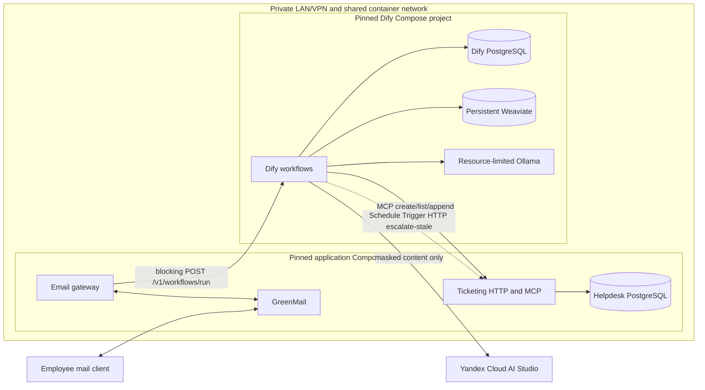
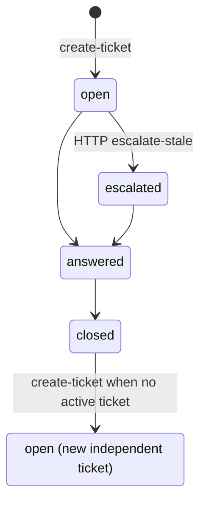

# v1 Architecture

This is the as-built design of the LLM email slice. Transport and durable
business behavior stay outside Dify. The gateway depends on a small blocking
HTTP contract, not Studio internals. Dify orchestrates the LLM/KB/MCP graph.
The human/operator path remains out of scope.

## Modules and interfaces

- **Email gateway module** — owns IMAP/SMTP (generic IMAP poll, default 1
  minute, configurable; GreenMail is the adapter, not its HTTP mail API).
  It normalizes plain text / sanitized HTML, ignores attachments, one-way
  masks PII via `src/privacy` **before** any Dify call, then either replies
  from ordered gateway regex (FR-2) or POSTs blocking
  `POST …/v1/workflows/run`. It validates `data.outputs`, SMTP-replies using
  the live mail-session recipient (``In-Reply-To`` / ``References`` from the
  inbound ``Message-ID``), then may set IMAP `\Seen`. A failed Dify call or
  unusable outputs: log error, skip SMTP, leave UNSEEN. No application
  outbox. The gateway does not call MCP and does not escalate.
- **Dify brain module** — orchestrates LLM, KB, and MCP. Two Workflow-type
  Apps (graphs of nodes — not an agent that function-calls tools). MCP is
  invoked by **tool nodes**. Arguments are wired from other nodes (Start
  `user_email` → MCP `user_id`; list/create output → append `ticket_id`;
  categorizer → `category`). The answer LLM node does not function-call MCP
  and must not invent `user_id` / `ticket_id`. Ticket/KB routing: FR-3.
  - `email_helpdesk` — User Input start; Knowledge Retrieval (Weighted
    Score, local Ollama embeddings); live Yandex on the answer LLM and
    classifiers. `create-ticket` must not run in parallel with append
    (needs `ticket_id`).
  - `escalate_stale` — Schedule Trigger that **only** HTTP-calls
    `POST /v1/tickets/escalate-stale`. Dify does not own escalate rules
    (FR-7).
- **Ticketing module** — sole authority for tickets, messages, escalation
  validity, and employee scope. Scope is the `user_id` tool argument
  (synthetic sender email) on `tickets.user_id`. MCP tools and private
  HTTP: FR-5 / FR-7. Schema: `tickets` and `messages` below. No tool reads
  `messages` back.
- **Privacy module** — one-way masking at the gateway (before Dify) and
  again at ticketing persist. Formats: SEC-2.
- **Knowledge module** — Git `knowledge_base/` is canonical; Weaviate is
  derived. Dataset name `employee-helpdesk`. Weighted Score, local Ollama
  embeddings. Search settings:
  [`tests/eval/golden_retrieval.json`](../tests/eval/golden_retrieval.json).
  End `source_filenames` are filenames; the gateway builds URLs (FR-4).
- **Lifecycle schedule** — `escalate_stale` calls ticketing HTTP. Rules
  stay in ticketing (FR-7). Local cadence: Recorded parameters in
  requirements.

## Conceptual application contracts

The **private HTTP adapter** is not a ticket resource API. It exposes
`POST /v1/tickets/escalate-stale` (status-only; FR-7). The route logs the
effective threshold, count, and ticket ids (no ticket text).

The **MCP adapter** takes `user_id` (synthetic sender email) as a tool
argument. Only Dify invokes these tools. Contracts: FR-5. Course MVP:
not production authentication (SEC-3).

- `create-ticket` — text only; no message row; reject if a non-`closed`
  ticket exists.
- `list-my-tickets` — scoped; newest `updated_at`; optional `statuses`.
- `append-message` — no status or ticket-text change; bumps `updated_at`.

The **workflow** (not the create tool) adds the first user mail via
`append-message` after `create-ticket`. No MCP tool answers or escalates
tickets.

## Deployment topology



The two Compose projects use pinned images, plugins, and model tags.
This slice uses Yandex Cloud AI Studio as the external generator;
embedding stays local Ollama. Dify uses `http://ollama:11434` on the
Compose network. Dify's PostgreSQL and helpdesk PostgreSQL never share
ownership or schemas.

Compose definitions live at root `compose.yml` (application stack:
email-gateway, ticketing, helpdesk PostgreSQL, GreenMail) and
`dify/compose.yml` (Dify platform: Dify, its PostgreSQL, Weaviate,
Ollama). Each file carries a short top comment naming the stack. The
Dify project creates the shared Docker network `helpdesk_private`; the
application project joins it as external (start Dify first).
`plugin_daemon` and `ssrf_proxy` also join that network so Studio MCP
can reach `http://ticketing:8080/mcp/` (trailing slash; Starlette
mount). Squid still denies other private hosts;
`SSRF_PROXY_ALLOW_PRIVATE_DOMAINS` is `ticketing` only. The root
`Makefile` wraps both with foreground `make dify-stack-up` /
`make app-stack-up` (two terminals). Secret-free Dify App DSL exports
live under `dify/apps/`.

## Minimal Dify contract

Gateway-facing app: `email_helpdesk`. Start field types: `user_email` and
`subject` = short text; `request_text` and `blockquote` = paragraph.
**Not** JSON Field.

```text
inputs (User Input / Start):
  user_email      # sender mailbox; MCP user_id
  subject
  request_text    # already-masked latest unquoted question (KR)
  blockquote      # already-masked quoted thread; "" when none

outputs (End):
  reply_text         # required string; SMTP body (gateway may append
                     # Ticket: and Sources:)
  ticket_id          # optional string; set when a ticket exists
                     # (create or follow-up). Empty/omitted on KB-hit
                     # with no ticket. Gateway appends SMTP `Ticket:`
                     # when this is a non-empty string.
  source_filenames   # optional list[str] or null; omit/[] on KB miss.
                     # knowledge_base/ filenames (not URLs).
```

The gateway validates outputs. Extra keys are ignored. `Ticket:` and
`Sources:` footer rules: FR-4. Blocking JSON may still expose
`workflow_run_id` / usage metadata. SSE is optional.

**Host URL:** `POST http://localhost:13080/v1/workflows/run`  
**In-network (Compose, when the gateway runs in the app stack):**
`http://nginx:80/v1/workflows/run`  
**Header:** `Authorization: Bearer <app key>` from gitignored `.env`
(`DIFY_EMAIL_HELPDESK_API_KEY`). The key is created in the Workflow app:
left sidebar **API Access** (or Publish → Access API) → Create API Key.
The key selects the app; no app UUID in the path.

**Wrong URL:** `/console/api/installed-apps/{id}/workflows/run` (Studio
session). Never use the console API for the gateway.

Blocking example (keys must match Start names):

```json
{
  "inputs": {
    "user_email": "employee1@example.test",
    "subject": "VPN",
    "request_text": "already-masked latest question",
    "blockquote": ""
  },
  "response_mode": "blocking",
  "user": "employee1@example.test"
}
```

`user` is Dify’s log identity; set it to the same sender. The gateway
waits for `data.outputs`, validates, SMTP-replies, then may set `\Seen`.
Trust seams: SEC-6.

## Data ownership

- **Helpdesk PostgreSQL** (`helpdesk-db`): v1 tables are `tickets`
  (including MVP synthetic `user_id` email, category, status, masked
  `text` set at create, timestamps) and `messages` (required `ticket_id`
  FK; role; masked `text`; usage fields on agent rows — audit and tokens,
  not read back as agent memory). Employee scope is `tickets.user_id`
  only. No outbox, quarantine, idempotency, or scope-binding tables in
  v1. Ticketing persistence uses async SQLAlchemy with the psycopg
  driver (`postgresql+psycopg://`).
- **Dify PostgreSQL:** Dify-owned configuration and workflow operational
  data, isolated from helpdesk business data.
- **Git:** canonical knowledge Markdown, secret-free Dify DSL exports,
  contracts, migrations, and recovery instructions.
- **Weaviate:** derived retrieval index. Persistent for normal operation;
  disposable and reproducible from Git knowledge.
- **GreenMail/mailbox:** raw synthetic transport messages required for
  email tests. Not the source of truth for ticket/message effects.

No application JSON log is a data store (SEC-5). Ticketing logs text
lines; the gateway logs JSON. Named volumes and wipe/re-ingest:
[setup.md](setup.md).

## MVP schema (Postgres)

Enums and meanings:
[CONTEXT.md](../CONTEXT.md) / FR-6 / `contracts.enums`. `category`,
`status`, and `role` are StrEnums on the ORM (`SQLAlchemy Enum`,
`native_enum=False`): VARCHAR storage, not Postgres ENUM types. Text
columns store one-way-masked content. `tickets.text` is masked ticket
text (immutable after create); a message always belongs to a ticket.
Escalation does not insert messages.

```text
tickets
  id          UUID PRIMARY KEY
  user_id     TEXT NOT NULL          -- synthetic sender email (MVP)
  category    VARCHAR NOT NULL      -- TicketCategory
  status      VARCHAR NOT NULL      -- TicketStatus
  text        TEXT NOT NULL          -- masked ticket text (immutable after create)
  created_at  TIMESTAMPTZ NOT NULL
  updated_at  TIMESTAMPTZ NOT NULL
  INDEX (user_id)
  INDEX (status)

messages
  id          UUID PRIMARY KEY
  ticket_id   UUID NOT NULL REFERENCES tickets(id)
  role        VARCHAR NOT NULL      -- MessageRole
  text        TEXT NOT NULL          -- masked
  model       TEXT NULL
  tokens_in   BIGINT NULL
  tokens_out  BIGINT NULL
  latency_ms  INTEGER NULL
  created_at  TIMESTAMPTZ NOT NULL
  INDEX (ticket_id)
```

## Delivery semantics

Best-effort, at-least-once; SMTP duplicate window and `\Seen` rules:
FR-8.

## Ticket status machine



The final arrow creates another ticket; it does not reopen or link the
closed one. The LLM path does not write `answered` or `closed` except
tests poking the DB. Lifecycle: FR-7.
