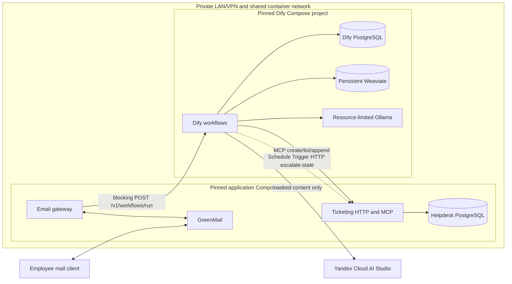
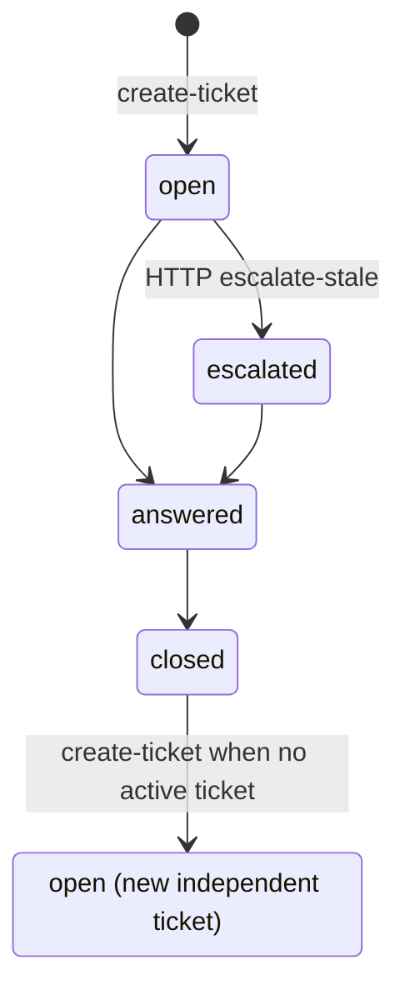

# v1 Architecture

This is the design target. Transport and durable business behavior stay
outside Dify. The gateway depends on a small blocking HTTP contract, not
Studio internals. Dify still orchestrates the LLM/KB/MCP graph.

The design is an LLM-focused slice: email in; Dify routes per the ticket/KB
table; `open` tickets whose `created_at` is older than the threshold
(default 24h / `escalation_seconds`) become `escalated`. Later
employee mail still uses the non-`closed` path (KB + answer + two appends).
`answered` and `closed` remain in the schema unused here. The
human/operator path remains out of scope.

## Modules and interfaces

- **Email gateway module** — generic IMAP poll (default 1 minute,
  configurable; GreenMail is the adapter, not its HTTP mail API), content
  normalization (plain text / sanitized HTML; ignore attachments), one-way
  PII masking via `src/privacy` **before** any Dify call, blocking Service
  API `POST …/v1/workflows/run`, validation of `data.outputs`, SMTP reply
  using the live mail-session recipient (``In-Reply-To`` / ``References``
  from the inbound ``Message-ID`` so the client threads the reply), then
  optional IMAP `\Seen`. A failed Dify call or unusable outputs: log error,
  skip SMTP, leave UNSEEN (next poll retries). No
  application outbox. After masking, ordered gateway regex intake
  (toxicity, then cheap injection/SQL phrases, then hello) may SMTP-reply
  without Dify. No gateway MCP,
  escalate-in-gateway, or size/rate gates (limits deferred).
- **Dify brain module** — two Workflow-type Apps (graphs of nodes and
  edges on the Studio canvas — not an agent that function-calls tools).
  MCP is invoked by **tool nodes**. Arguments are wired from other nodes
  (Start `user_email` → MCP `user_id`; list/create output → append
  `ticket_id`; categorizer → `category`). The answer LLM node does not
  function-call MCP and must not invent `user_id` / `ticket_id`.
  - `email_helpdesk` — User Input start. Graph design (committed DSL is
    this topology with Knowledge Retrieval and live Yandex on the answer
    LLM and classifiers — not a Start→End echo):
    (1) intent SML on `request_text` (`safe` | `injection` | `off-topic`);
    `injection` / `off-topic` skip KR, the answer LLM, and all MCP and may
    share one static Template `reply_text` → End; (2) `safe` →
    `list-my-tickets`; (3) retrieve: Knowledge Retrieval with Weighted Score
    (local Ollama embeddings) then a dedicated answer LLM; (4) IF a non-`closed` ticket: answer LLM → append user → append
    agent (sequential appends); (5) ELSE IF KB hit: answer LLM → End, no
    MCP create/append; (6) ELSE knowledge gap: answer LLM admits the miss;
    then a sequential categorizer SML on `request_text` → `create-ticket`
    (needs category + text) → append user → append agent. Skip the
    categorizer on KB-hit and follow-up paths. `create-ticket` must not
    run in parallel with append (needs `ticket_id`). Toxicity, cheap
    injection/SQL phrases, and hello stay gateway regex.
  - Escalate — Schedule Trigger (daily / 24h; hourly allowed for demo)
    that **only** HTTP-calls `POST /v1/tickets/escalate-stale`, with a
    retry policy (counts TBD). No escalate rules in Dify.
- **Ticketing module** — the sole authority for tickets, messages, escalation
  validity, and employee scope. It derives employee scope from the `user_id`
  tool argument (synthetic sender email) on `tickets.user_id`. MCP tools are
  `create-ticket`, `list-my-tickets`, and `append-message`. Private HTTP is
  `POST /v1/tickets/escalate-stale`. v1 schema is intentionally small:
  `tickets` and `messages` (`messages.ticket_id` required FK; employee
  scope lives on `tickets.user_id` only). No tool reads `messages` back.
- **Privacy module** — deterministically one-way masks email, phone-like
  values, and Luhn-valid payment-card candidates into one shared format:
  `[email]`; `+** *** ** ** NN` (last two digits kept); `****-****-****-****`.
  The gateway uses it before Dify and the ticketing module applies it again
  at its persistence seam for ticket/message text. Masking is not
  reversible encrypt/decrypt.
- **Knowledge module** — treats versioned Markdown in Git (`knowledge_base/`)
  as canonical, produces trusted source metadata, and reproducibly ingests
  one Dify knowledge base named `employee-helpdesk`. The email workflow
  Knowledge Retrieval node uses Weighted Score with local embeddings via
  Ollama. Recorded search settings live in
  [`tests/eval/golden_retrieval.json`](../tests/eval/golden_retrieval.json).
  End `source_filenames` are `knowledge_base/` filenames from retrieval;
  the gateway builds Git URLs under a configured URL prefix.
- **Lifecycle schedule** — the Escalate Dify app calls private HTTP
  `POST /v1/tickets/escalate-stale` (retry policy, counts TBD). Ticketing
  selects `open` rows whose `created_at` is older than the threshold
  (default `Settings.escalation_seconds` / 86400) and sets
  `escalated` (status-only). Append refreshes `updated_at` (last activity)
  but does not delay escalate. After `escalated`, later employee mail still
  uses the non-closed path; append does not change status. No reopen. The
  human/operator path remains out of scope. Hourly trigger is allowed for
  demo.

## Conceptual application contracts

The **private HTTP adapter** is not a ticket resource API. It exposes
`POST /v1/tickets/escalate-stale`.
Escalate is status-only. The route logs the effective threshold, count,
and ticket ids (no ticket text). A gateway Dify HTTP or outputs failure is not
fail-open: the gateway logs the error, skips SMTP, and leaves the message
UNSEEN for the next poll. Ticketing
does not require a quarantine or outbox table.

The **MCP adapter** takes `user_id` (synthetic sender email) as a tool
argument on each call. Only Dify invokes these tools:

- `create-ticket` creates one scoped `open` ticket: masked `text` in
  `tickets.text` (set at create, not updated). **No message row.** Rejects if
  this `user_id` already has a non-`closed` ticket.
- `list-my-tickets` lists only tickets for that `user_id`, newest
  `updated_at` first. Each row includes masked `tickets.text`. Optional
  `statuses`: omitted/`None` defaults to `open`, `escalated`, and
  `answered`; empty `statuses=[]` returns no rows; unknown strings are
  `NOT_ELIGIBLE`.
- `append-message` inserts one `user` or `agent` row on an existing ticket
  and bumps `tickets.updated_at` (last activity; list order). Required:
  `ticket_id`, `user_id`, `text`, `role`. Load the ticket and deny
  with `NOT_FOUND` when missing or `ticket.user_id != user_id`. Agent rows
  may set usage (`model` / tokens / latency). Append does not change ticket
  text or status. Return is `message_id` and `ticket_id` (always set).

The **workflow** (not the create tool) adds the first user mail via
`append-message` after `create-ticket`. No MCP tool answers or escalates
tickets. For the course MVP, ticketing stores synthetic sender email as
`tickets.user_id`. A call is scoped to its `user_id` argument (wrong ticket
id is rejected); choosing another employee's email is not prevented. This
is not production authentication.

## Deployment topology



The two Compose projects use pinned images, plugins, and model tags. This
slice uses Yandex Cloud AI Studio as the external generator; embedding
stays local Ollama. Dify uses `http://ollama:11434` on the Compose network.
Dify's PostgreSQL and helpdesk PostgreSQL never share ownership or schemas.

Compose definitions live at root `compose.yml` (application stack:
email-gateway, ticketing, helpdesk PostgreSQL, GreenMail) and
`dify/compose.yml` (Dify platform: Dify, its PostgreSQL, Weaviate, Ollama).
Each file carries a short top comment naming the stack. The Dify project
creates the shared Docker network `helpdesk_private`; the application
project joins it as external (start Dify first). `plugin_daemon` and
`ssrf_proxy` also join that network so Studio MCP can reach
`http://ticketing:8080/mcp/` (trailing slash; Starlette mount). Squid still denies other private hosts;
`SSRF_PROXY_ALLOW_PRIVATE_DOMAINS` is `ticketing` only. The root `Makefile` wraps
both with foreground `make dify-stack-up` / `make app-stack-up` (two
terminals). Secret-free Dify App DSL exports live under `dify/apps/` —
`email_helpdesk.yml` is the graph above with Knowledge Retrieval
(Weighted Score, local embeddings) and live Yandex on the answer LLM
and classifier (MCP tool nodes, IF/ELSE, Ticket ID and Reply aggregators, End
`reply_text` / `ticket_id` / `source_filenames`). The Escalate app is
Phase 8.

## Minimal Dify contract

Gateway-facing app: `email_helpdesk`. Start field types: `user_email` and
`subject` = short text; `request_text` and `blockquote` = paragraph.
**Not** JSON Field.

```text
inputs (User Input / Start):
  user_email      # sender mailbox; MCP user_id
  subject
  request_text    # already-masked latest unquoted question (KR)
  blockquote      # already-masked quoted thread; "" when none

outputs (End):
  reply_text         # required string; SMTP body (gateway may append
                     # Ticket: and Sources:)
  ticket_id          # optional string; set when a ticket exists
                     # (create or follow-up). Empty/omitted on KB-hit
                     # with no ticket. Gateway appends SMTP `Ticket:`
                     # when this is a non-empty string.
  source_filenames   # optional list[str] or null; omit/[] on KB miss.
                     # knowledge_base/ filenames (not URLs).
```

The gateway validates outputs. Extra keys are ignored. It appends a
`Ticket:` line when End `ticket_id` is a non-empty string. It rejects
`source_filenames` that are not a single filename, builds
`{CITATION_URL_BASE}{filename}`, and appends a `Sources:` footer unless
`reply_text` contains the knowledge-gap marker (`I don't know`, same
string as the workflow IF/ELSE `value`) — case-insensitive, even when
filenames are present. Empty, omitted, or null `source_filenames` skip
the footer. Blocking JSON may still expose `workflow_run_id` / usage
metadata. SSE is optional, not the Phase 4 interface.

**Host URL:** `POST http://localhost:13080/v1/workflows/run`  
**In-network (Compose, when the gateway runs in the app stack):**
`http://nginx:80/v1/workflows/run`  
**Header:** `Authorization: Bearer <app key>` from gitignored `.env`
(`DIFY_EMAIL_HELPDESK_API_KEY`). The key is created in the Workflow app:
left sidebar **API Access** (or Publish → Access API) → Create API Key. The
key selects the app; no app UUID in the path.

**Wrong URL:** `/console/api/installed-apps/{id}/workflows/run` (Studio
session). Never use the console API for the gateway.

Blocking example (keys must match Start names):

```json
{
  "inputs": {
    "user_email": "employee1@example.test",
    "subject": "VPN",
    "request_text": "already-masked latest question",
    "blockquote": ""
  },
  "response_mode": "blocking",
  "user": "employee1@example.test"
}
```

`user` is Dify’s log identity; set it to the same sender. Merge-gate tests
use a **fake** of this contract (no paid models, no live Studio in CI).
Local/opt-in may call the live graph.

The old `WorkflowRequestV1` / `WorkflowResultV1` action-enum contract is
retired. The gateway waits for `data.outputs`, validates, SMTP-replies,
then may set `\Seen`.

## Controlled request flow

1. The gateway polls IMAP, normalizes mail identity, and uses the sender
   mailbox as `user_email` / MCP `user_id` (MVP).
2. It normalizes plain text or sanitized HTML and ignores attachments.
3. It one-way-masks required PII. Size/rate limits are deferred.
4. Gateway regex intake (toxicity, then cheap injection/SQL phrases, then
   hello) uses the **full** masked subject+body before the
   `request_text`/`blockquote` split: a match SMTP-sends a static body (no
   Dify, no KB, no MCP). Otherwise the gateway splits that body into
   `request_text` (latest unquoted question) and `blockquote` (quoted
   remainder, or `""`) and POSTs blocking
   `/v1/workflows/run`. Knowledge Retrieval stays on `request_text`. It does
   not call MCP. If that call fails or End
   outputs are unusable, the gateway logs an error, skips SMTP, and leaves
   the message UNSEEN for the next poll.
5. Dify classifies `request_text` (`safe` | `injection` | `off-topic`).
   `injection` / `off-topic` skip MCP, KR, and the answer LLM (no ticket,
   no append); they may share one static Template `reply_text` that SMTP
   when the workflow finishes. `safe` calls
   `list-my-tickets` and follows ticket/KB routing:

   | State | KB can answer | DB |
   | --- | --- | --- |
   | No non-`closed` ticket | yes | **no** ticket, **no** `messages` — email only + citations |
   | No non-`closed` ticket | no | `create-ticket` **and** `append-message` user then agent; `reply_text` admits the miss; SMTP includes the new `ticket_id` |
   | Non-`closed` ticket already exists (`open` **or** `escalated`) | yes or no | **always** append user + agent; **still run KB**; SMTP `Ticket:` when End `ticket_id` is set |

   Employee cannot override a KB hit into a new ticket. Categorizer runs
   only on the knowledge-gap path, sequentially before `create-ticket`.
   `create-ticket` must not run in parallel with append.
6. The gateway validates `data.outputs` (`reply_text` required). Unusable
   outputs: log error, skip SMTP, leave UNSEEN. Usage on the blocking
   response may be passed on the agent append (Dify performs that append).
   Bad or out-of-scope ids fail on the MCP call inside Dify.
7. On valid outputs, the gateway SMTP-sends `reply_text` (with a `Ticket:`
   line when End `ticket_id` is a non-empty string, and a Sources footer when
   `source_filenames` is non-empty and `reply_text` does not contain the
   knowledge-gap marker) using the live
   mail-session recipient, then may set IMAP `\Seen`. A failed Dify call
   does not SMTP and does not set `\Seen`. Effects are best-effort
   at-least-once. SMTP duplicate window: one poll interval (default 60s)
   plus the blocking Dify wait, if send succeeded but `\Seen` was not set.

## Trust seams

- Email bodies, headers, sanitized HTML, retrieved passages, and all model
  output are untrusted. Attachment contents do not enter the system.
- Repository-controlled workflow schemas, tool definitions, governing
  instructions, and source-filename-to-URL mappings are trusted configuration.
  Retrieved document text remains data: embedded instructions cannot change
  routing, tool authorization, or trusted citation URLs.
- Dify and its model are behind a validation seam: only validated
  `data.outputs` can drive gateway SMTP. End `source_filenames` are
  knowledge_base filenames; the gateway turns them into citation URLs.
  Ticketing independently enforces authorization, valid transitions, and
  masking for every HTTP/MCP mutation.
- MCP tools take `user_id` (sender email) as a tool argument. Ticketing
  scopes each call to that value and rejects ticket ids owned by a different
  `user_id`. In the workflow, MCP arguments are wired from Start / list /
  create / categorizer — not from the answer LLM, which must not invent
  `user_id` / `ticket_id`. A caller who can invoke MCP can still pass any
  synthetic email; this is not production authentication.
- This slice uses Yandex Cloud AI Studio as the external generator and
  sends it only already-masked content. SMTP uses the gateway's live
  recipient from the mail session.
- The HTTP and MCP adapters are private-network interfaces.

## Data ownership

- **Helpdesk PostgreSQL** (`helpdesk-db`): v1 tables are `tickets` (including
  MVP synthetic `user_id` email, category, status, masked `text` set at
  create, timestamps),
  and `messages` (required `ticket_id` FK; role; masked `text`; usage fields
  on agent rows — audit and tokens, not read back as agent memory). Employee
  scope is `tickets.user_id` only. No outbox,
  quarantine, idempotency, or scope-binding tables in v1. Ticketing
  persistence uses async SQLAlchemy with the psycopg driver
  (`postgresql+psycopg://`).
- **Dify PostgreSQL:** Dify-owned configuration and workflow operational data,
  isolated from helpdesk business data.
- **Git:** canonical knowledge Markdown, secret-free Dify DSL exports,
  contracts, migrations, and recovery instructions.
- **Weaviate:** derived retrieval index. It is persistent for normal operation
  but disposable and reproducible from Git knowledge.
- **GreenMail/mailbox:** raw synthetic transport messages required for email
  tests. Not the source of truth for ticket/message effects.

No application JSON log is a data store. Application logs contain opaque
references and bounded metadata, never raw content. Ticketing and the email
gateway each have a process-local `logging_config` today (ticketing: text
lines; gateway: JSON). Later, one shared `dictConfig` module under `src/`
(alongside `privacy` / `contracts`): same JSON formatter and SEC-5 extras
allowlist; each process still calls `getLogger(__name__)` under its package
name. Not Phase 4 scope.

## MVP schema (Postgres)

Enums and meanings:
[CONTEXT.md](../CONTEXT.md) / FR-6 / `contracts.enums`. `category`, `status`,
and `role` are StrEnums on the ORM (`SQLAlchemy Enum`, `native_enum=False`):
VARCHAR storage, not Postgres ENUM types. Text columns store one-way-masked
content. `tickets.text` is masked ticket text (immutable after create);
a message always belongs to a ticket. Escalation does not insert messages.

```text
tickets
  id          UUID PRIMARY KEY
  user_id     TEXT NOT NULL          -- synthetic sender email (MVP)
  category    VARCHAR NOT NULL      -- TicketCategory
  status      VARCHAR NOT NULL      -- TicketStatus
  text        TEXT NOT NULL          -- masked ticket text (immutable after create)
  created_at  TIMESTAMPTZ NOT NULL
  updated_at  TIMESTAMPTZ NOT NULL
  INDEX (user_id)
  INDEX (status)

messages
  id          UUID PRIMARY KEY
  ticket_id   UUID NOT NULL REFERENCES tickets(id)
  role        VARCHAR NOT NULL      -- MessageRole
  text        TEXT NOT NULL          -- masked
  model       TEXT NULL
  tokens_in   BIGINT NULL
  tokens_out  BIGINT NULL
  latency_ms  INTEGER NULL
  created_at  TIMESTAMPTZ NOT NULL
  INDEX (ticket_id)
```

## Delivery semantics

Ticket/message effects are best-effort and at-least-once. The gateway may
mark an inbound message processed (IMAP `\Seen`) after successful SMTP of
an intake or workflow reply. A failed Dify call does not SMTP and does
not set `\Seen`. Poll retries may repeat mutations.

SMTP remains gateway-owned and at-least-once. Without an outbox table, a crash
after send and before `\Seen` can duplicate the email on the next poll.
Documented window: one poll interval (default 60s) plus the blocking Dify
wait. Receiver-visible exactly-once delivery is not claimed.

## Ticket status machine



The final arrow creates another ticket; it does not reopen or link the closed
one. The LLM path does not write `answered` or `closed` except tests poking
the DB. `append-message` inserts a message and bumps `tickets.updated_at`;
it does not change ticket text or status. After `escalated`, the LLM still
replies and appends; status stays `escalated`. No reopen. The
human/operator path remains out of scope.

## Persistence and recovery principles

- Named volumes preserve both PostgreSQL stores and Weaviate across ordinary
  restarts. Migrations are repeatable and backups/restores are tested before
  acceptance.
- Ticket and message data live in PostgreSQL; mailbox flags such as `\Seen` are
  a best-effort processing hint, not a durable exactly-once guarantee in v1.
- Canonical knowledge remains in Git. Reproducible ingestion can delete and
  rebuild the Weaviate index, preserving source IDs and trusted URLs.
- The reviewed, secret-free Dify exports reconstruct workflow structure.
  Provider credentials stay in Dify's encrypted store; other secrets use
  gitignored local files with committed examples only.
- Minimal Make targets cover env/deps bootstrap and foreground stack up/down. Use
  `docker compose` directly for logs/ps. Destructive volume deletion (`docker compose … down -v`) is manual
  and irreversible — document the risk before using it.

## Proposed repository tree

```text
.
├── README.md
├── CONTEXT.md
├── docs/
│   ├── requirements.md
│   ├── architecture.md
│   ├── roadmap.md
│   ├── setup.md
│   └── adr/
├── knowledge_base/
├── dify/
│   ├── compose.yml              # Dify platform stack
│   └── apps/                    # one secret-free DSL export per Dify App
│       └── email_helpdesk.yml   # email graph (Weighted Score KR; live Yandex)
├── src/
│   ├── contracts/
│   ├── privacy/
│   ├── email_gateway/
│   └── ticketing/
├── tests/
│   ├── unit/
│   ├── contract/
│   ├── integration/
│   ├── e2e/
│   └── eval/                    # golden catalog + opt-in live retrieval
├── scripts/
├── compose.yml                  # application stack
├── Makefile
└── pyproject.toml
```
