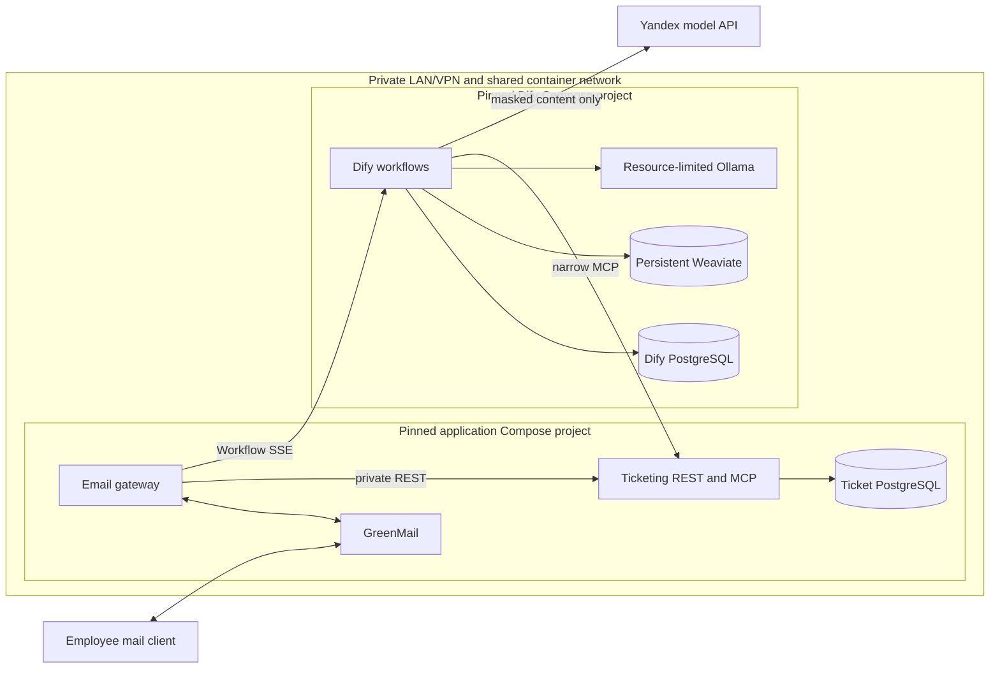
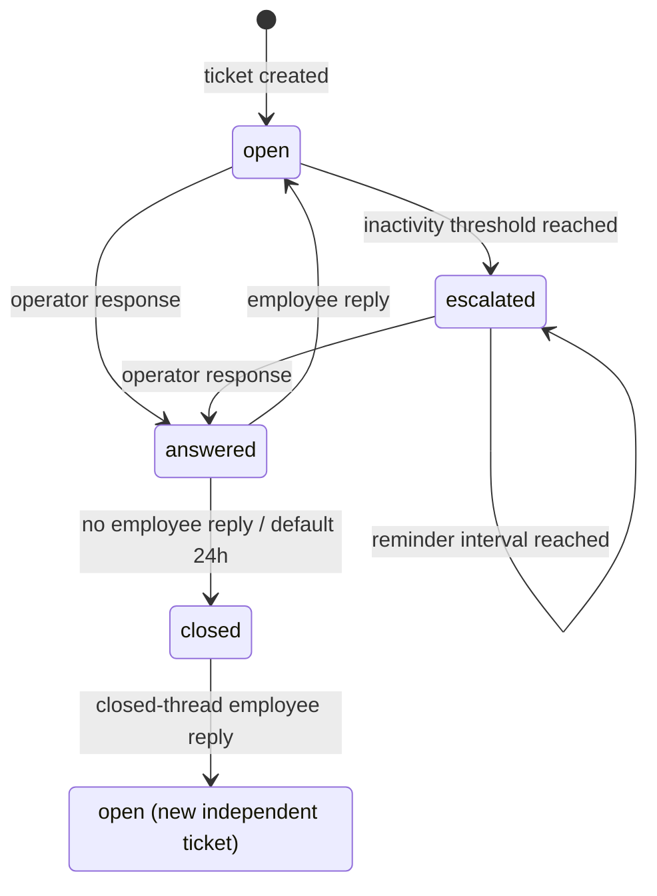

# v1 Architecture

This is the Phase 1 design target, not a description of an implemented runtime.
It keeps transport and durable business behavior outside Dify so the AI brain
can be replaced through one small interface.

## Modules and interfaces

- **Email gateway module** — hides generic IMAP/SMTP transport, content
  normalization, size/rate controls, a pre-Dify toxicity/abuse word-list gate
  (static reply, no LLM), pre-Dify PII masking, workflow SSE consumption, and
  outbox delivery. GreenMail is its first mail adapter; the normal poll
  interval is one minute and is configurable for tests.
- **Dify brain module** — self-hosted Workflow-type Dify Apps (node graphs) for
  bounded scope/injection classification, ticket-context routing, retrieval,
  grounded Yandex generation, and narrow MCP calls. Sufficient knowledge
  evidence produces a grounded answer and does not create a ticket, including
  when the employee asked for one. Its only gateway-facing interface is the
  versioned workflow contract below. A separate scheduled Dify App owns daily
  lifecycle digests/reminders without an LLM.
- **Ticketing module** — the sole authority for conversations, tickets,
  messages, lifecycle transitions, inbound idempotency, quarantine, and the
  SMTP outbox. It derives employee scope from opaque capabilities. One
  application interface has a private REST adapter for the gateway and a
  narrow MCP adapter for Dify.
- **Privacy module** — deterministically masks email, phone-like values, and
  Luhn-valid payment-card candidates. The gateway uses it before Dify and the
  ticketing module applies it again at its persistence seam.
- **Knowledge module** — treats versioned Markdown in Git as canonical,
  produces trusted source metadata, and reproducibly ingests one Dify
  knowledge base. Dify performs High-Quality hybrid retrieval over Weaviate
  using local `granite-embedding:30m`; no reranker is present initially.
- **Lifecycle schedule** — a separate Dify workflow runs daily, queries
  eligible stale tickets through narrow MCP operations, requests escalation
  and auto-close transitions, and creates an idempotent deterministic operator
  digest/reminder without an LLM. The ticketing module validates time, state,
  and idempotency and enqueues the notice for gateway delivery; an escalated
  ticket becomes eligible again on its configured reminder interval.

## Conceptual application contracts

The **private REST adapter** accepts normalized mail identity only from the
gateway. Claiming an inbound message returns its idempotency context, an
opaque/unguessable employee-conversation capability, and authoritative current
ticket context. It also reconciles claimed MCP effects, finalizes workflow and
transport metadata, and manages quarantine and outbox claim/acknowledgement.

The **narrow MCP adapter** receives capability and idempotency context from
workflow runtime bindings, outside model-controlled arguments:

- `create-ticket` idempotently creates one scoped ticket and its initial
  history.
- `list-my-tickets` lists only tickets derived from the current capability.
- `append-message` appends one message attributed to an authorized actor on a
  scoped ticket.
- stale/lifecycle and authenticated operator operations remain task-shaped and
  narrow; no tool exposes SQL or accepts arbitrary `user_id`.

One logical message has one writer. If MCP creates/appends it, REST
finalization references the returned message identities and only attaches
workflow/transport metadata and delivery intent; it never appends those
messages again. Without an MCP history mutation, REST may persist the
non-ticket conversation message.

The capability prevents model-selected cross-employee access; it does not turn
email headers into production authentication. GreenMail sender identity is
acceptable only for synthetic v1 tests, and real-mail sender assurance is
deferred.

## Deployment topology



The two Compose projects use pinned images, plugins, and model tags. Yandex is
the only external model processor receiving application content in v1;
configuration and acceptance reject other external model providers. Ollama is
internal. Dify's PostgreSQL and ticket PostgreSQL never share ownership or
schemas.

Compose definitions live at root `compose.yml` (application stack: gateway,
ticketing, ticket PostgreSQL, GreenMail) and `dify/compose.yml` (Dify platform:
Dify, its PostgreSQL, Weaviate, Ollama). Each file carries a short top comment
naming the stack. The Dify project creates the shared Docker network
`helpdesk_private`; the application project joins it as external (start Dify
first). The root `Makefile` wraps both with foreground
`make dify-stack-up` / `make app-stack-up` (two-terminal operator workflow).
Secret-free Dify App DSL exports live under `dify/apps/` after UI authoring
(FR-9) — one YAML export per Studio App (email helpdesk in Phase 5; ticket
lifecycle in Phase 8). Phase 2 proves Start→End in the Studio UI without a
committed handwritten DSL file.

## Minimal Dify contract

All strings are bounded and the gateway validates both input and output. The
contract contains no raw recipient address and no Yandex-specific shape.

```text
WorkflowRequestV1
  contract_version: "1"
  message_ref: opaque string
  correlation_ref: opaque string
  conversation_ref: opaque string
  scope_capability: opaque unguessable string (not a model argument)
  masked_subject: string
  masked_body: string
  ticket_context?: { ticket_id, category, state }

WorkflowResultV1
  contract_version: "1"
  action: grounded_answer
        | ticket_created
        | ticket_updated
        | ticket_listed
        | blocked_injection
        | rejected_non_helpdesk
        | deferred
  reply_text: string
  ticket_id?: string
  message_ids?: [string]
  tickets?: [{ ticket_id, category, state, updated_at }]
  citations: [{ source_id, title, trusted_url }]
```

`ticket_created` and `ticket_updated` require the authoritative `ticket_id` and
bounded `message_ids` returned by MCP; `ticket_listed` returns the bounded
scoped list. A grounded answer requires at least one citation assembled from
trusted repository metadata; the gateway rejects URLs outside the configured
repository base. Other actions return no citations. The gateway maps a
classifier/workflow outage to the same local `deferred` outcome and quarantine
path.

Execution metadata is not model output. The gateway separately consumes Dify
Workflow SSE to capture `workflow_run_id`, answer-generator input/output token
usage, and latency, then stores those values in the tutor-shaped message
fields. Provider selection remains deployment configuration.

## Controlled request flow

1. The gateway polls a message, normalizes its mail identity, derives the
   stable inbound identity, and claims it through private REST before any
   external or business effect. REST returns the idempotency context, scope
   capability, and authoritative current-ticket context.
2. It normalizes plain text or sanitized HTML, ignores attachments, and
   enforces size/rate limits.
3. Before any Dify or model call, it applies a configured toxicity/abuse
   word-list (regex). A match sends a static reply, creates no ticket, and
   skips Dify entirely.
4. Otherwise it masks required PII and invokes Dify through SSE. Before ticket
   or RAG routing, explicit nodes apply deterministic injection patterns and a
   bounded Yandex injection/scope classifier:
   - injection returns a static block and no ticket;
   - non-helpdesk input returns a bounded refusal and no ticket;
   - classifier outage returns control for quarantine and a deferred
     acknowledgement.
5. For legitimate content, authoritative ticket context takes precedence:
   - `open`/`escalated`: append the employee message once and return a
     deterministic `ticket_updated` acknowledgement, without RAG or a new
     ticket;
   - `answered`: append once, transition to `open`, and return
     `ticket_updated`;
   - `closed`: create a new independent ticket;
   - no applicable ticket: handle scoped list/status intent if present;
     otherwise run retrieval/evidence routing. Sufficient evidence returns a
     grounded cited answer and does **not** create a ticket, even when the
     employee explicitly asked for one. Insufficient evidence creates a
     ticket; uncategorized legitimate work uses `other`.
6. The gateway validates the typed result and SSE metadata. Before sending
   `ticket_created` or `ticket_updated`, it reconciles the claimed
   ticket/messages through REST under the current capability and idempotency
   context. REST finalization references any MCP-owned message, stores remaining
   masked metadata, and enqueues the reply without double-writing history.
7. The outbox delivers through SMTP and records the outcome. The inbox message
   is acknowledged only after durable internal processing, so a poll retry
   cannot duplicate ticket or message effects.

## Trust seams

- Email bodies, headers, sanitized HTML, retrieved passages, and all model
  output are untrusted. Attachment contents do not enter the system.
- Repository-controlled workflow schemas, tool definitions, governing
  instructions, and source-ID-to-URL mappings are trusted configuration.
  Retrieved document text remains data: embedded instructions cannot change
  routing, tool authorization/capability, or trusted citation URLs.
- Dify and its model are behind a validation seam: only the typed result and
  validated citation metadata can drive gateway behavior. Ticketing
  independently enforces authorization, valid transitions, masking, and
  idempotency for every REST/MCP mutation.
- The scope capability is injected by a workflow runtime binding rather than
  chosen by the model. Ticketing derives employee scope and rejects arbitrary
  identity arguments.
- Yandex is the only external model processor and receives only already-masked
  content. Raw delivery addresses remain encrypted inside the application
  stack for the shortest practical outbox lifetime.
- The REST and MCP adapters are private-network interfaces. Operator MCP
  actions additionally require authentication.

## Data ownership

- **Ticket PostgreSQL:** authoritative masked conversations, messages and tutor
  token fields; tickets and lifecycle; inbound idempotency; quarantine; and
  encrypted short-lived outbox recipients.
- **Dify PostgreSQL:** Dify-owned configuration and workflow operational state,
  isolated from ticket business data.
- **Git:** canonical knowledge Markdown, secret-free Dify DSL exports,
  contracts, migrations, and recovery instructions.
- **Weaviate:** derived retrieval index. It is persistent for normal operation
  but disposable and reproducible from Git knowledge.
- **GreenMail/mailbox:** raw synthetic transport messages required for email
  tests. This is not business persistence or a ticket/conversation source of
  truth and is explicitly outside the application's PII-absence invariant.

No application JSON log is a data store. Application logs contain opaque
references and bounded metadata, never raw content.

## Delivery semantics

Every mutating REST or MCP command carries an idempotency key. The ticketing
module serializes competing claims and stores the result, allowing the gateway
and Dify to retry after timeouts without repeating internal effects. The normal
inbound identity is `(mailbox identity, RFC Message-ID)`. If that header is
absent, it is `(mailbox identity, UIDVALIDITY, UID)`. The stored key is an
opaque/HMAC encoding of the selected identity tuple; raw message content never
participates.

SMTP remains at-least-once. The outbox records intent before sending and marks
delivery after SMTP acceptance. A crash between those two events causes a
retry and can duplicate the email. The implementation must document the retry
and retention horizon that bounds this duplicate window; receiver-visible
exactly-once delivery is not claimed.

## Ticket state machine



The final arrow creates another ticket; it does not reopen or link the closed
one. Scheduling requests transitions, while the ticketing module owns their
validity and records `system` messages for automated changes.

## Persistence and recovery principles

- Named volumes preserve both PostgreSQL stores and Weaviate across ordinary
  restarts. Migrations are repeatable and backups/restores are tested before
  acceptance.
- Inbox claims, idempotent mutation results, quarantine, and outbox state live
  with ticket data, so restart recovery resumes rather than reconstructs
  business effects from mailbox flags.
- Canonical knowledge remains in Git. Reproducible ingestion can delete and
  rebuild the Weaviate index, preserving source IDs and trusted URLs.
- The reviewed, secret-free Dify exports reconstruct workflow structure.
  Provider credentials stay in Dify's encrypted store; other secrets use
  gitignored local files with committed examples only.
- Minimal Make targets cover env bootstrap and foreground stack up/down. Use
  Compose directly for logs/ps; tests, seed/ingest, and restore arrive in later
  phases. Destructive volume deletion (`docker compose … down -v`) is manual
  and irreversible — document the risk before using it.

## Proposed repository tree

This is a later-phase target; Phase 1 creates only the Markdown documents.
Eval suite layout under `tests/` is deferred until the knowledge/evaluation
phase; co-locate cases and rubrics when that work starts.

```text
.
├── README.md
├── CONTEXT.md
├── docs/
│   ├── requirements.md
│   ├── architecture.md
│   ├── roadmap.md
│   ├── setup.md
│   └── adr/
├── knowledge_base/
├── dify/
│   ├── compose.yml              # Dify platform stack
│   └── apps/                    # one secret-free DSL export per Dify App
│       ├── email_helpdesk.yml   # names finalized at Studio export time
│       └── ticket_lifecycle.yml
├── src/
│   ├── contracts/
│   ├── privacy/
│   ├── email_gateway/
│   └── ticketing/
├── tests/
│   ├── unit/
│   ├── contract/
│   ├── integration/
│   └── e2e/
├── scripts/
├── compose.yml                  # application stack
├── Makefile
└── pyproject.toml
```
