# Demo screenshots

Local GreenMail and Thunderbird. The mailbox is up only while
`make app-stack-up` is running. How to send mail: the root
[README](../../README.md).

1. Employee question (knowledge hit).

   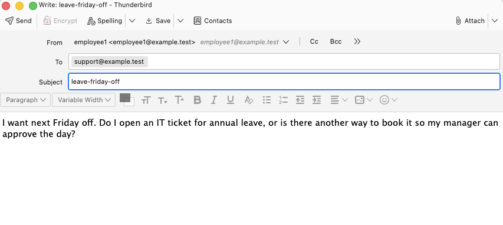

2. Agent reply with a `Sources:` footer.

   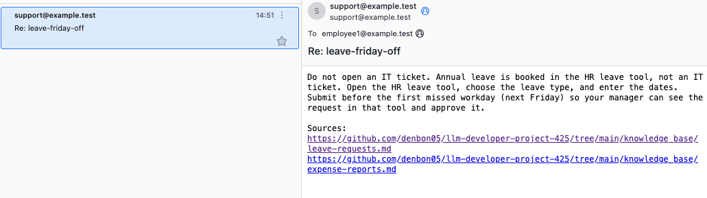

3. Employee follow-up the knowledge base cannot answer.

   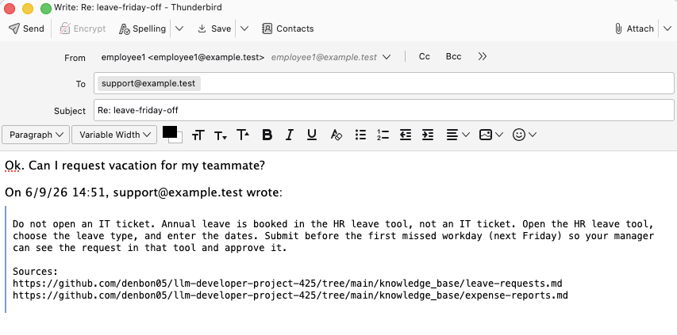

4. Knowledge-gap reply: `I don't know` and a `Ticket:` id.

   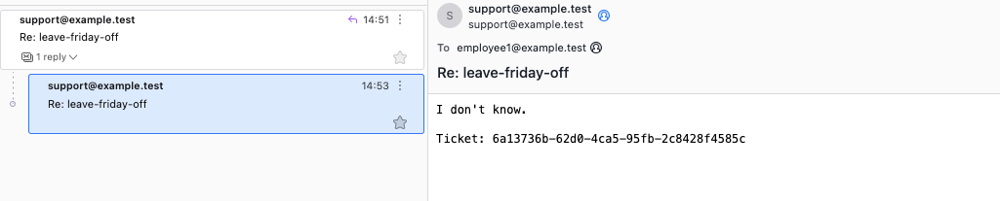

5. Operator escalation digest for that ticket.

   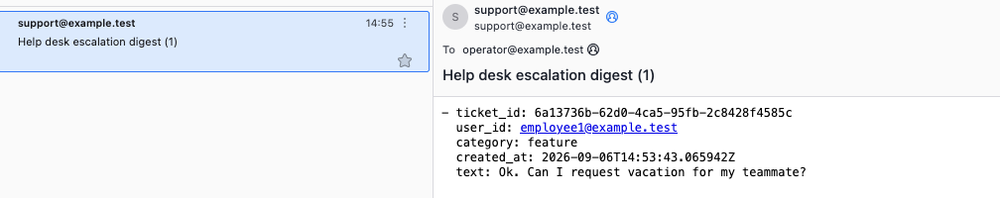

Dify Studio Logs → Tracing for the knowledge-gap run (item 4).
Tool-node Input / Output is what the workflow wrote on MCP calls.

6. Tracing tab: node list, timings, and token counts.

   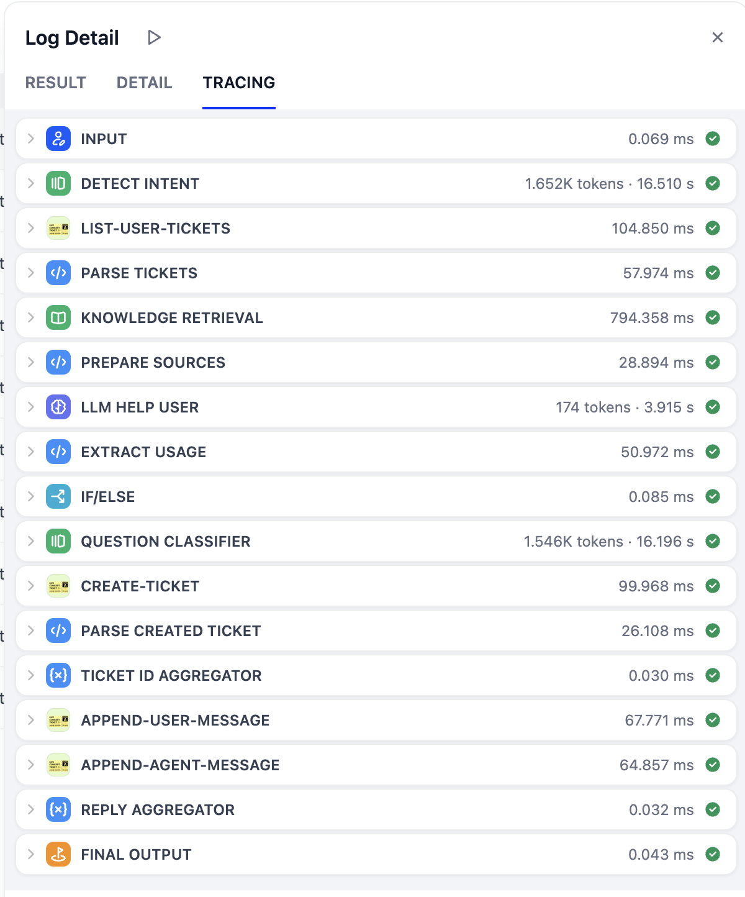

7. Workflow graph for that run.

   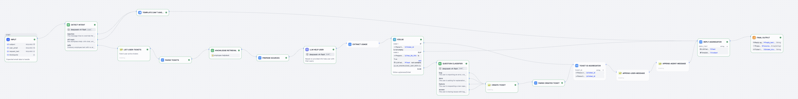

8. `list-user-tickets` (empty; no open ticket yet).

   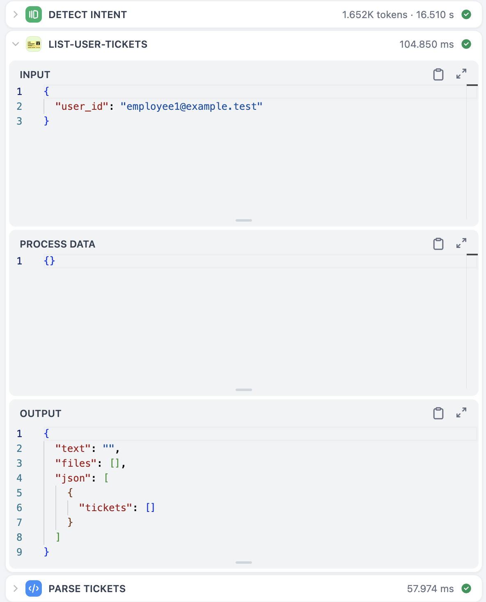

9. `create-ticket` after the knowledge miss.

   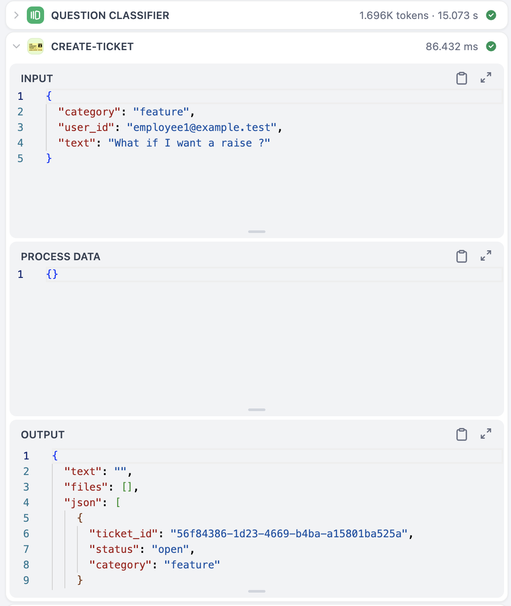

10. `append-user-message` for the inbound mail.

    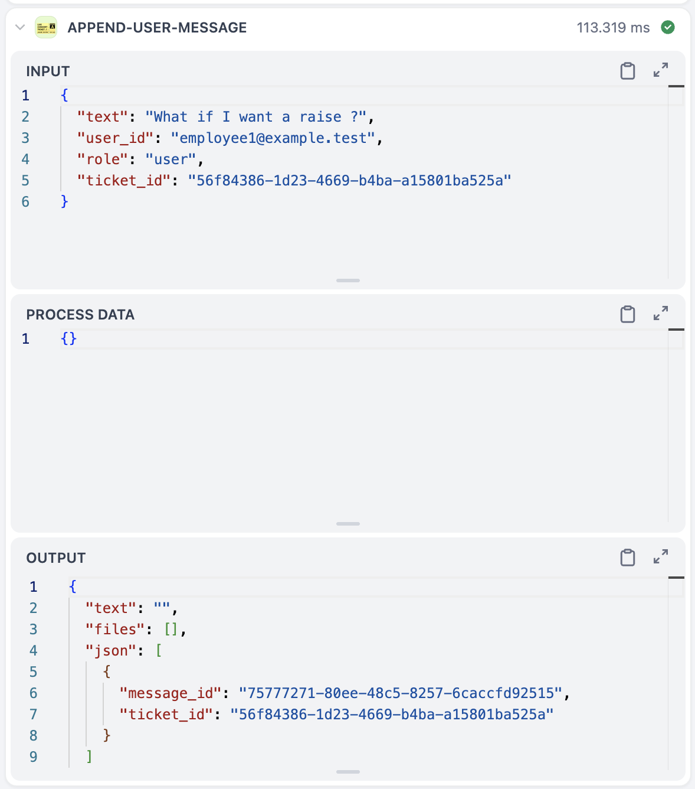

11. `append-agent-message` for the `I don't know` reply.

    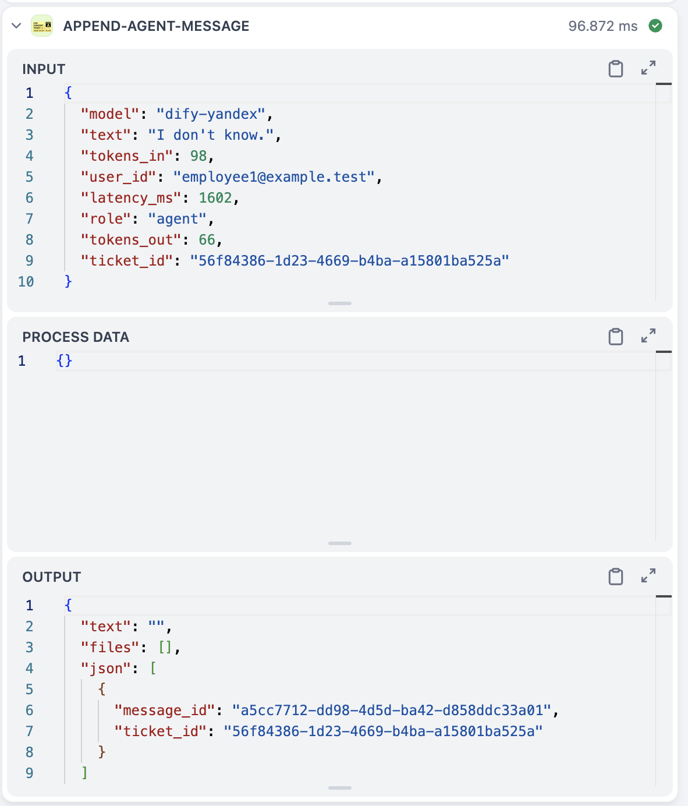
